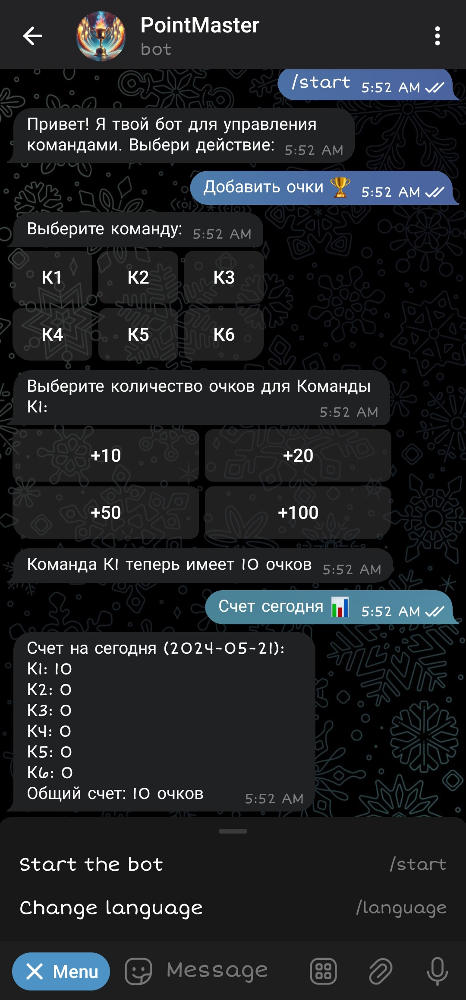
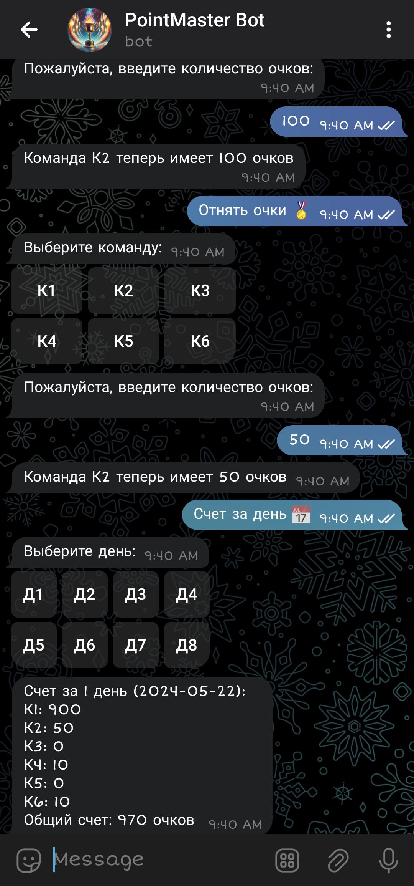
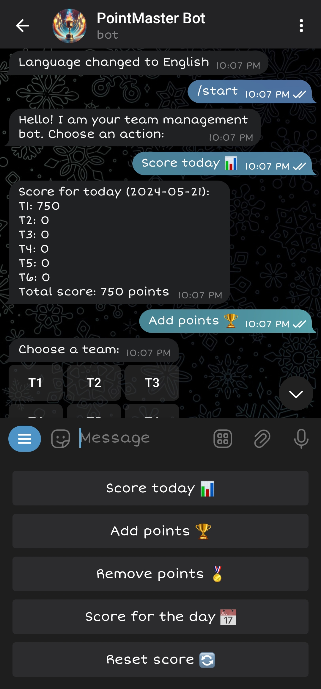
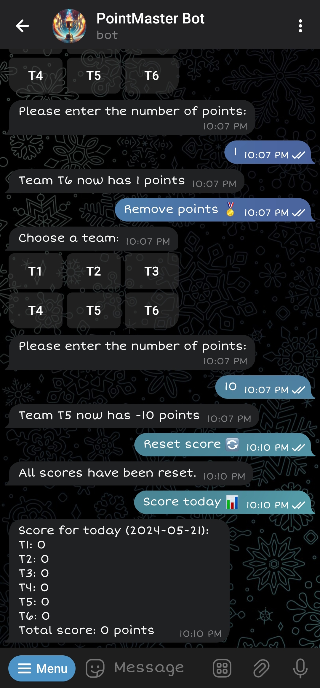

# PointMaster Bot

[PointMaster Bot](https://t.me/point_master_bot) is a Telegram bot designed to track and manage team scores over an 8-day period. The bot provides a user-friendly interface for adding and removing points from teams, viewing current scores, and checking scores for previous days. The bot supports both English and Russian languages.

[PointMaster Bot](https://t.me/point_master_bot) — это Telegram-бот, предназначенный для отслеживания и управления счетами команд в течение 8 дней. Бот предоставляет удобный интерфейс для добавления очков командам, просмотра текущего счета и проверки счетов за предыдущие дни.

## Screenshots / Скриншоты

|  |  |
|:-----------------------------:|:-----------------------------:|
|  |  |

## Usage / Использование

- **`/start`**: Starts the bot and greets the user / Запускает бота и приветствует пользователя.
- **`Add points 🏆` / `Добавить очки 🏆`**: Allows adding points to a team / Позволяет добавить очки команде.
- **`Remove points 🏅` / `Отнять очки 🏅`**: Allows removing points from a team / Позволяет отнять очки у команды.
- **`Score today 📊` / `Счет сегодня 📊`**: Shows the current score / Показывает текущий счет.
- **`Score for the day 📅` / `Счет за день 📅`**: Allows viewing scores for previous days / Позволяет посмотреть счет за предыдущие дни.
- **`Reset score 🔄` / `Сбросить счет 🔄`**: Resets the score / Сбрасывает счет.
- **`/language`**: Switches the bot's language between English and Russian / Переключает язык бота между английским и русским.

## Installation / Установка

1. **Clone the repository or download the project archive / Клонируйте репозиторий или скачайте архив с проектом**:

    ```bash
    git clone https://github.com/y9938/point_master_bot.git
    cd point_master_bot
    ```

2. **Create and activate a virtual environment / Создайте и активируйте виртуальное окружение**:

    ```bash
    python3 -m venv venv
    ```

3. **Activate the virtual environment / Активируйте виртуальное окружение**:

    - For Linux and macOS / Для Linux и macOS:

        ```bash
        source venv/bin/activate
        ```

    - For Windows / Для Windows:

        ```bash
        .\venv\Scripts\activate
        ```

4. **Install the dependencies / Установите зависимости**:

    ```bash
    pip install -r requirements.txt
    ```

5. **Create a `.env` file and add your Telegram bot token / Создайте файл `.env` и добавьте в него токен вашего Telegram-бота**:

    ```plaintext
    BOT_TOKEN=your_bot_token_here
    ```

6. **Start the bot / Запустите бота**:

    ```bash
    python main.py
    ```

## Tips / Советы

- **Virtual Environment Activation / Активация виртуального окружения**: Remember to activate the virtual environment every time you start working on the project. If you close your terminal, you'll need to reactivate it. / Помните, что нужно активировать виртуальное окружение каждый раз, когда вы начинаете работать над проектом. Если вы закроете терминал, вам нужно будет снова его активировать.
- **Environment Variables / Переменные окружения**: Keep your `.env` file secure and never share it publicly, as it contains sensitive information. / Держите ваш файл `.env` в безопасности и никогда не делитесь им публично, так как он содержит конфиденциальную информацию.

## License / Лицензия

This project is licensed under the [MIT License](LICENSE) / Этот проект лицензирован по лицензии [MIT](LICENSE).
